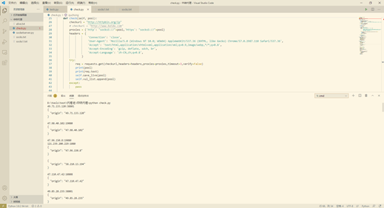
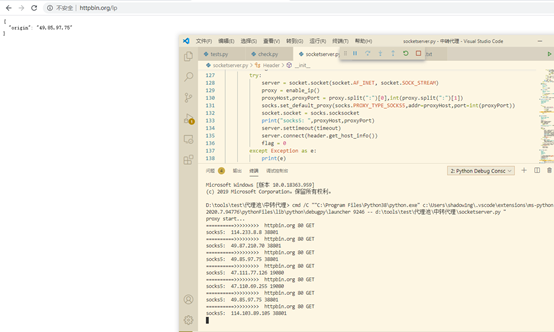
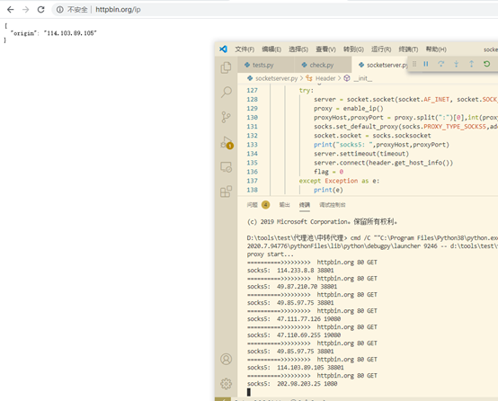

# ProxyPool
一款用于自动切换ip的代理池服务,无需任何依赖，能快速运行。

运行方法:python3 server.py  

# 搜集使用新代理步骤如下：
## 1.搜集可用socks5代理
免费代理url  http://free-proxy.cz/zh/proxylist/country/CN/socks5/ping/all  
选择国家和代理类型(socks5),点击导出

## 2.检测存活
多线程检测socks.txt中的存活代理，写入alive.txt，并自动去重

## 3.开启服务
`python3 server.py`

## 4.设置burp设置http代理端口(不是socks5)

## 5.测试
访问 http://httpbin.org/ip ，多次刷新，发现访问ip一直在变  

